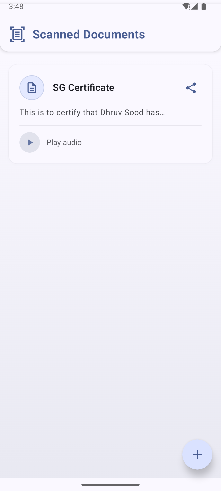
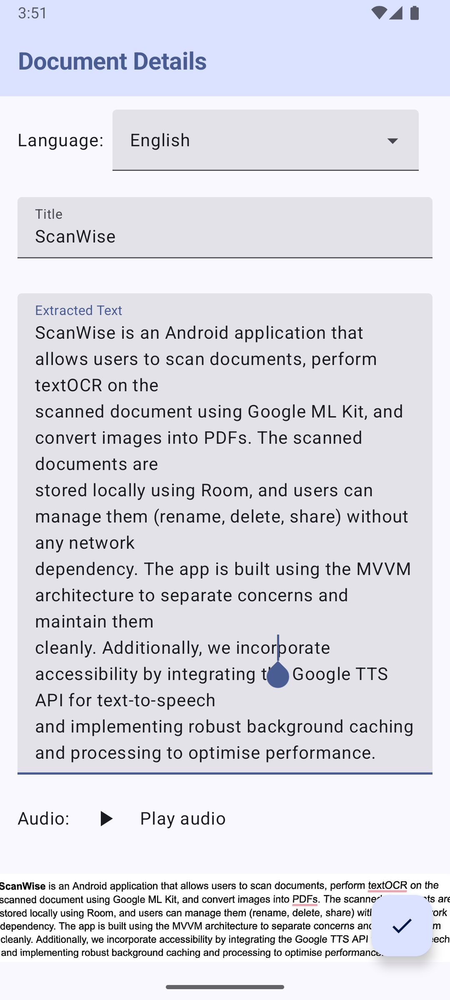
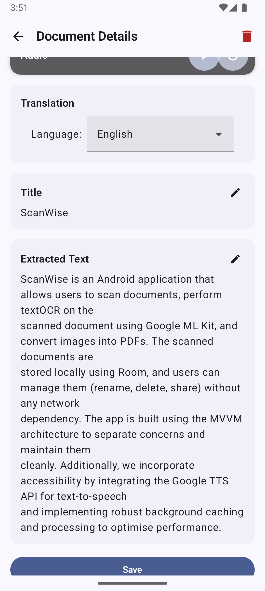
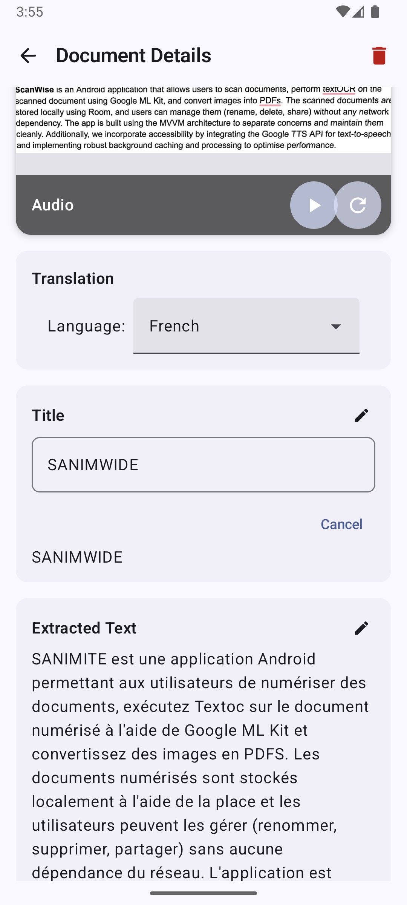
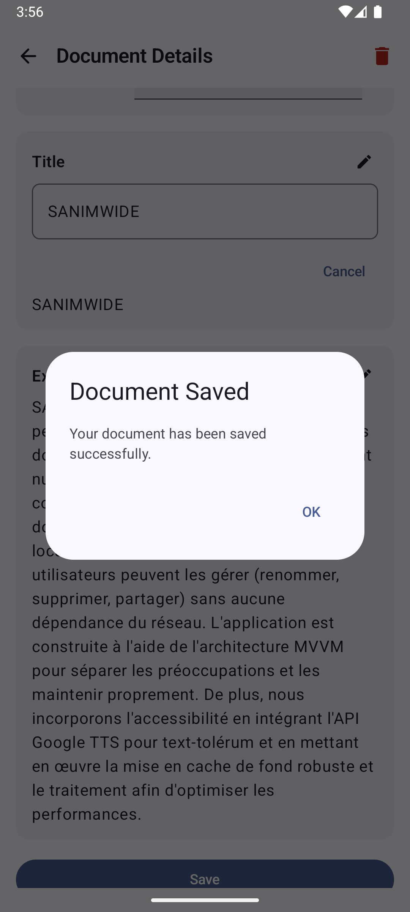
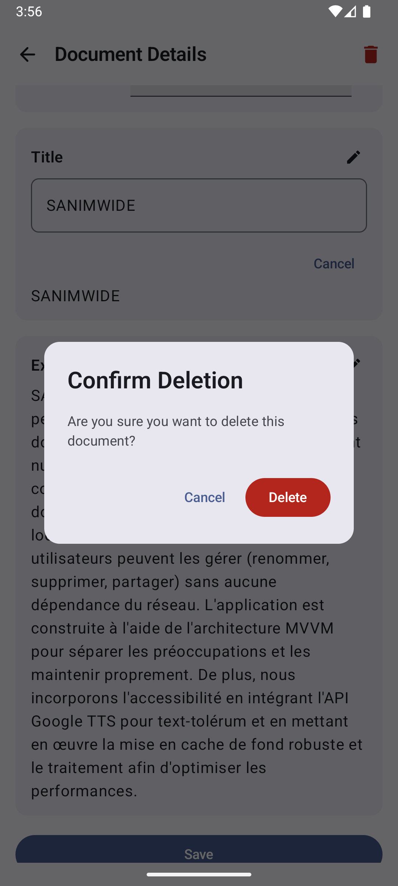
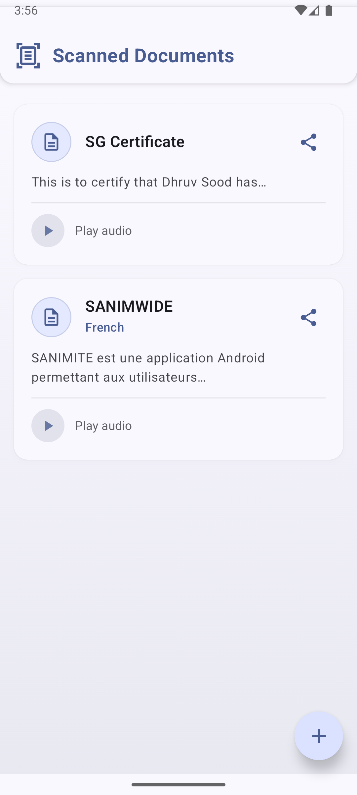

# ScanWise

A powerful document scanning and management application with OCR, translation, and accessibility features.

**Developed by:** Paras Dhiman (2021482) & N Narotam (2021477)

## Screenshots

<table>
  <tr>
    <td></td>
    <td></td>
    <td></td>
  </tr>
  <tr>
    <td></td>
    <td></td>
    <td></td>
  </tr>
  <tr>
    <td></td>
  </tr>
</table>

## Overview

ScanWise is an Android application that enables users to scan documents, extract text using Google ML Kit's OCR capabilities, and manage the documents locally. The app is designed with accessibility in mind, featuring translation services and text-to-speech functionality to make document content accessible to a wider audience.

## Key Features

### 📱 Document Scanning
- Capture documents using the device camera
- Automatic text extraction using Google ML Kit OCR
- Clean document preview with image processing

### 📄 Document Management
- View all scanned documents in an organized library
- Edit document titles and content
- Delete unwanted documents
- Local storage using Room database for offline access

### 🔊 Accessibility Features
- Text-to-speech functionality to listen to document content
- Audio playback controls (play, stop, regenerate)
- Save audio files for later playback

### 🌐 Translation Services
- Translate document content to multiple languages
- Currently supported languages:
  - English
  - French
  - Spanish
- Real-time translation with visual progress indication

## Architecture

ScanWise is built using the MVVM (Model-View-ViewModel) architecture to ensure separation of concerns and maintainability:

### Components

- **View Layer**: Jetpack Compose UI components
- **ViewModel Layer**: Manages UI state and business logic
- **Repository Layer**: Provides data access abstraction
- **Data Sources**:
  - Room Database for document storage
  - ML Kit for text extraction
  - Translation service for language translation
  - TTS processor for text-to-speech functionality

### Major Screens

#### 1. Scan Fragment
- Camera capture interface
- Document processing with ML Kit
- Initial document preview

#### 2. Add Document Screen
- Document details with extracted text
- Translation options
- Audio generation capabilities
- Save functionality

#### 3. Library Fragment
- List of all saved documents
- Quick actions (play audio, view details)
- Search and filter options

#### 4. Detail Screen
- Comprehensive document view
- Edit document content
- Translation controls
- Audio playback
- Delete functionality

## Technical Implementation

### OCR Processing
```kotlin
fun processDocument(imageUri: Uri, context: Context, onResult: (String) -> Unit) {
    val image: InputImage = InputImage.fromFilePath(context, imageUri)
    recognizer.process(image)
        .addOnSuccessListener { visionText ->
            val title = extractTitle(visionText)
            val fullText = visionText.text
            val textPath = saveOCRTextToFile(context, fullText)
            val resultString = "$title|$fullText|$textPath"
            onResult(resultString)
        }
}
```

### Translation Service
The app uses a custom TranslationService that supports:
- Language detection
- Text translation between supported languages
- Asynchronous processing with coroutines

### Text-to-Speech
```kotlin
fun generateAudioForLanguage(text: String, languageCode: String) {
    _uiState.value = _uiState.value.copy(isGeneratingAudio = true)
    ttsProcessor?.setLanguage(languageCode)
    ttsProcessor?.generateAudioFile(text) { audioPath ->
        _uiState.value = _uiState.value.copy(
            audioPath = audioPath,
            isGeneratingAudio = false
        )
    }
}
```

### UI Components
ScanWise uses Jetpack Compose for modern, declarative UI:
- Material Design 3 components
- Responsive layouts
- Accessibility considerations
- Loading state indicators

## Getting Started

### Prerequisites
- Android Studio Hedgehog or later
- Minimum SDK: API 24 (Android 7.0)
- Target SDK: API 34 (Android 14)

### Installation
1. Clone the repository:
   ```bash
   https://github.com/greasyfinger/ScanWise.git
   ```
2. Open the project in Android Studio
3. Sync Gradle files
4. Build and run on your device or emulator

### Dependencies
- Jetpack Compose UI toolkit
- Room persistence library
- Google ML Kit for text recognition
- Hilt for dependency injection
- Coil for image loading
- Kotlin Coroutines for asynchronous programming

## Future Enhancements
- Add support for additional languages
- Implement document categorization
- Add cloud backup functionality
- Include PDF export capabilities
- Improve OCR accuracy for handwritten text

## License
This project is licensed under the MIT License - see the LICENSE file for details.

## Acknowledgments
- Google ML Kit for the OCR capabilities
- Android Jetpack libraries for the modern app architecture
- Material Design for the UI components
